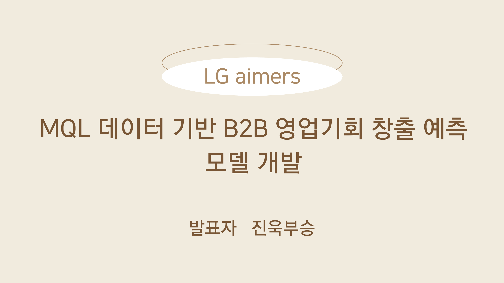
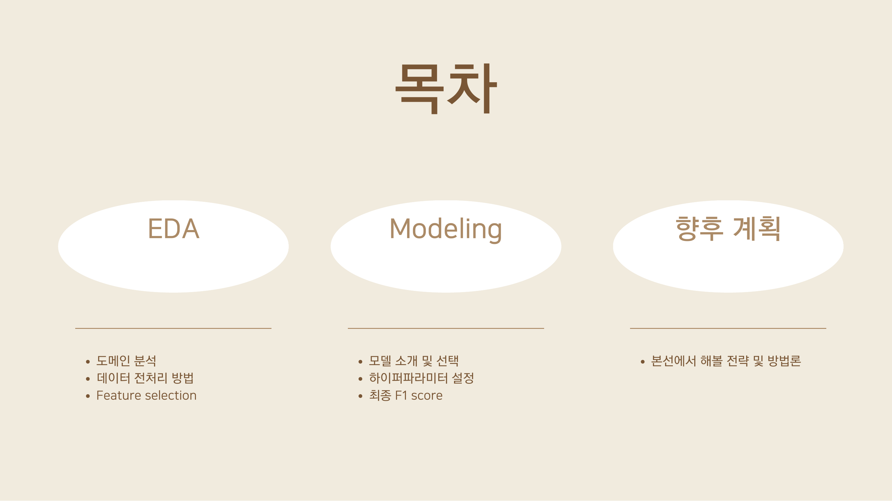
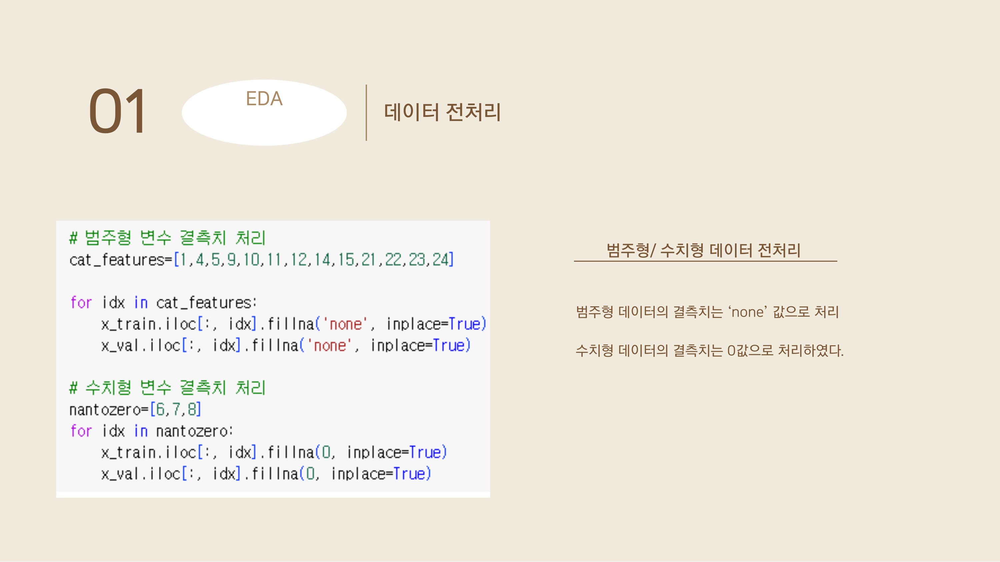
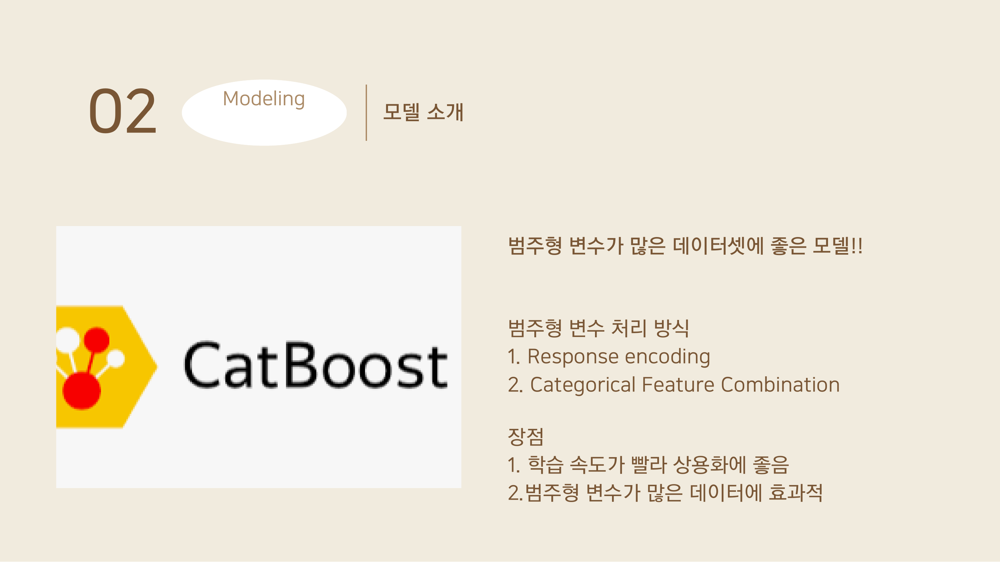
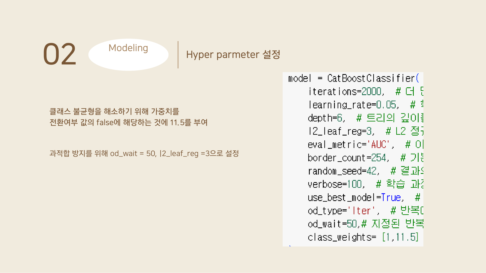
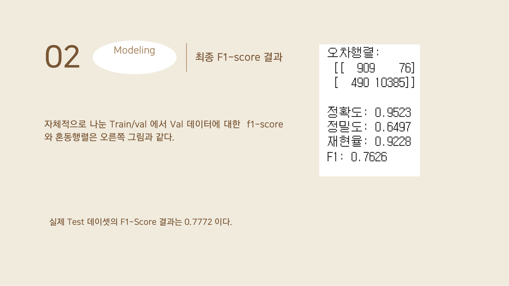
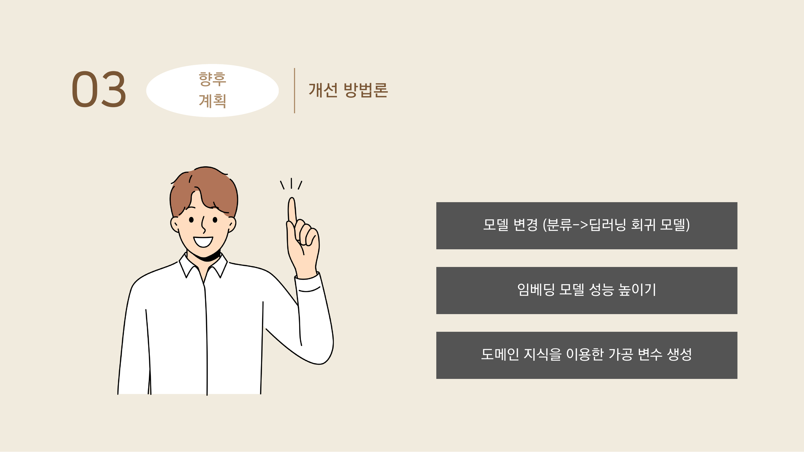

# 🏆 LG Aimers 4th - MQL 데이터 기반 B2B 영업기회 창출 예측

> **LG Aimers 4기** 해커톤 참가 프로젝트
> MQL(Marketing Qualified Lead) 데이터를 활용한 B2B 영업기회 전환 여부 이진 분류 모델 개발
> **최종 F1-Score: 0.772** (Public Leaderboard 기준)

---

## 📊 발표 자료 (슬라이드 요약)

### Slide 1 - 타이틀


**MQL 데이터 기반 B2B 영업기회 창출 예측 모델 개발**
LG Aimers 4기 해커톤 발표 자료. 발표자: 진욱·부승

---

### Slide 2 - 목차


발표 구성은 크게 3개 섹션으로 구성:
- **EDA** : 도메인 분석 → 데이터 전처리 방법 → Feature Selection
- **Modeling** : 모델 소개 및 선택 → 하이퍼파라미터 설정 → 최종 F1 Score
- **향후 계획** : 본선에서 해볼 전략 및 방법론

---

### Slide 3 - EDA: 도메인 분석 (B2B)


**B2B(Business-to-Business)** 도메인을 이해하고 접근.
- B2B는 기업 간 거래로, 의사결정 과정이 길고 다양한 이해관계자가 개입
- MQL(Marketing Qualified Lead)은 마케팅 활동을 통해 영업 적격성이 확인된 잠재 고객
- 고객의 `bant_submit`, `lead_desc_length`, 기존 거래 이력 등이 전환 가능성의 핵심 지표

---

### Slide 4 - EDA: 데이터 전처리


데이터 타입별 결측치 처리 전략:

| 데이터 타입 | 결측치 처리 방법 |
|:---:|:---:|
| 범주형 (categorical) | `'none'` 문자열로 대체 |
| 수치형 (numerical) | `0` 값으로 대체 |
| 텍스트형 (text) | `''` 빈 문자열로 대체 |

```python
# 범주형 변수 결측치 처리
cat_features = [1,4,5,9,10,11,12,14,15,21,22,23,24]
for idx in cat_features:
    x_train.iloc[:, idx].fillna('none', inplace=True)

# 수치형 변수 결측치 처리
nantozero = [6,7,8]
for idx in nantozero:
    x_train.iloc[:, idx].fillna(0, inplace=True)
```

---

### Slide 5 - Modeling: CatBoost 모델 선택


**CatBoostClassifier** 를 선택한 이유:

- 이 데이터셋은 `customer_country`, `business_unit`, `customer_type` 등 **범주형 변수가 다수 포함**
- CatBoost는 범주형 변수를 별도 인코딩 없이 자동 처리하는 알고리즘
- **Response Encoding**: 타겟값 기반으로 범주형 변수를 수치화
- **Categorical Feature Combination**: 여러 범주형 변수를 조합하여 새로운 특성 자동 생성
- 학습 속도가 빠르고 과적합에 강인

---

### Slide 6 - Modeling: 하이퍼파라미터 설정


핵심 하이퍼파라미터 설정 및 근거:

```python
model = CatBoostClassifier(
    iterations=2000,       # 충분한 학습 반복
    learning_rate=0.05,    # 안정적 수렴을 위한 학습률
    depth=6,               # 과적합 방지용 트리 깊이 제한
    l2_leaf_reg=3,         # L2 정규화로 과적합 방지
    eval_metric='AUC',
    class_weights=[1, 11.5], # ⭐ 클래스 불균형 해소 (True:False ≈ 1:11.5)
    od_type='Iter',
    od_wait=50,            # 50회 개선 없으면 조기 종료
    use_best_model=True,
)
```

> **클래스 불균형 처리**: 타겟값 `is_converted`의 True(전환됨):False(미전환) 비율이 약 1:11.5로
> 심각한 불균형이 존재. `class_weights=[1, 11.5]`로 소수 클래스(True)에 가중치를 부여해 해결.

---

### Slide 7 - 최종 F1-Score 결과


**검증 데이터(Val) 성능:**

| 지표 | 점수 |
|:---:|:---:|
| 정확도 (Accuracy) | 0.9523 |
| 정밀도 (Precision) | 0.6497 |
| 재현율 (Recall) | 0.9228 |
| **F1-Score** | **0.7626** |

```
혼동행렬:
         예측 True  예측 False
실제 True    909        76
실제 False   490     10385
```

**실제 Test 데이터셋 F1-Score: `0.7772`**

---

### Slide 8 - 향후 계획


본선 진출 후 성능 향상을 위한 3가지 전략:

1. **모델 변경**: 분류 모델 → 딥러닝 기반 회귀 모델로 전환
2. **임베딩 모델 성능 향상**: 텍스트 피처(`customer_country`, `customer_job`, `product_modelname` 등)에 더 강력한 언어 모델 적용
3. **도메인 지식 기반 가공 변수 생성**: B2B 영업 도메인 이해를 바탕으로 유의미한 파생 피처 설계

---

### Slide 9-10 - Q&A / 감사합니다


---

## 💻 코드 설명

### 파일 구성

```
📁 LGaimers_4th
├── 📓 LG_aimers4_CatBoost.ipynb           # 초기 실험 버전
├── 📓 LG_aimers4_CatBoost_sota (0.772).ipynb  # 최종 SOTA 버전 (F1: 0.772)
└── 📊 LG aimers.pdf                        # 발표 자료
```

---

### `LG_aimers4_CatBoost.ipynb` — 초기 실험 버전

기본 CatBoost 파이프라인을 구성한 탐색 노트북.

**핵심 특징:**
- `cat_features=[3]`: 범주형 피처 최소 설정
- `embedding_features=[0, 1]`: 텍스트 피처를 임베딩으로 처리 시도
- `iterations=10`, `learning_rate=0.03`: 빠른 프로토타이핑을 위한 최소 설정
- 별도 전처리 없이 CatBoost의 자동 처리 능력 테스트

```python
train_data = Pool(
    x_train, label=y_train,
    cat_features=[3],
    embedding_features=[0, 1]  # 텍스트 임베딩 시도
)
model = CatBoostClassifier(iterations=10, learning_rate=0.03)
```

---

### `LG_aimers4_CatBoost_sota (0.772).ipynb` — 최종 SOTA 버전

체계적인 피처 엔지니어링과 하이퍼파라미터 튜닝으로 **F1=0.772** 달성.

#### 1. 피처 엔지니어링 (핵심)

**가공변수 1: `same_country`** — 고객 국가와 담당 법인 위치 일치 여부
```python
# 고객 국적과 자사 담당 법인의 지역 정보(대륙) 일치 여부
df_train['same_country'] = (
    df_train['customer_country'] == df_train['customer_country.1']
).astype(int)
df_train['same_country'] = df_train['same_country'].map({0: '불일치', 1: '일치'})
```

**가공변수 2: `engagement_weight_sum`** — 고객 참여도 종합 점수
```python
def calculate_engagement_weight(row):
    weight = 0
    if row['bant_submit'] < 0.5:          # BANT 점수 낮으면 +0.5
        weight += 0.5
    if row['lead_desc_length'] > avg:     # 문의 내용이 상세하면 +1.5
        weight += 1.5
    if row['historical_existing_cnt'] == 0: # 신규 고객이면 +1.0
        weight += 1.0
    return weight
```

#### 2. 결측치 처리 전략

```python
# 텍스트 피처: 빈 문자열로
text_features = [0, 13, 16]  # customer_country, product_modelname, business_subarea
for idx in text_features:
    x_train.iloc[:, idx].fillna('', inplace=True)

# 범주형 피처: 'none'으로
cat_features = [1,4,5,9,10,11,12,14,15,21,22,23,24]
for idx in cat_features:
    x_train.iloc[:, idx].fillna('none', inplace=True)

# 수치형 피처: 0으로
nantozero = [6,7,8]
for idx in nantozero:
    x_train.iloc[:, idx].fillna(0, inplace=True)
```

#### 3. CatBoost Pool 설정

```python
train_data = Pool(
    x_train, label=y_train,
    cat_features=[1,4,5,9,10,11,12,14,15,21,22,23,24],
    text_features=[0, 13, 16]  # TF-IDF 기반 텍스트 임베딩 자동 처리
)
```

#### 4. 모델 학습 결과

```
0:    test: 0.8880520  best: 0.8880520 (0)
100:  test: 0.9806222  best: 0.9806222 (100)
...
1288: bestTest = 0.9861470  ← 조기 종료

{'validation': {'AUC': 0.9861, 'Logloss': 0.1607}}
```

#### 5. 최종 성능 평가

```python
pred = model.predict(x_val)
pred = np.where(pred == 1, True, False)

# 결과
# 오차행렬:
#  [[  912    73]
#   [  487 10388]]
# 정확도: 0.9528
# 정밀도: 0.6519
# 재현율: 0.9259
# F1:     0.7651
```

---

## 🛠 사용 기술


| 라이브러리 | 용도 |
|:---:|:---:|
| `CatBoost` | 메인 분류 모델 (범주형 변수 자동 처리) |
| `pandas` / `numpy` | 데이터 처리 및 피처 엔지니어링 |
| `scikit-learn` | 데이터 분할 및 평가 지표 계산 |
| `Google Colab` | 학습 환경 |

---

## 📈 성능 요약

| 버전 | 주요 변경사항 | Val F1 | Test F1 |
|:---:|:---|:---:|:---:|
| 초기 버전 | 기본 CatBoost, 전처리 최소화 | - | - |
| **SOTA 버전** | 피처 엔지니어링 + 클래스 가중치 튜닝 | **0.7651** | **0.7772** |
